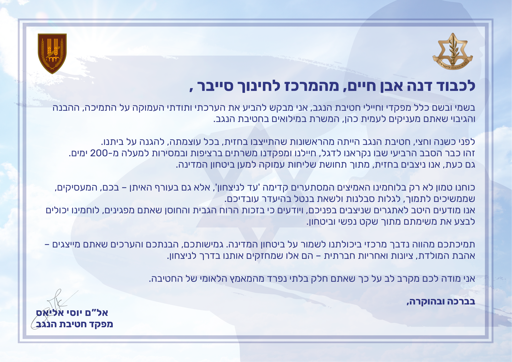

  
  
  

<h1 align="center">Thank You Letter Automation</h1>

<strong>By Amit Cohen</strong> 
Project for IDF Reserve Service - Developed for the Negev Brigade

---

<h2>About</h2>

This project was developed during my reserve army duty, where I served as an event producer for the Negev Brigade.

The goal:  
To generate and send **personalized thank-you letters** to the employers of reservist soldiers and their partners — in a scalable, accurate, and automated way.

The app takes structured data (CSV), overlays personal details onto a pre-designed PDF template, and emails it to each employer with a single click.

<h2>Features</h2>

- 📨 Automated Email Sending (with attachments)
- 📄 Personalized PDF Generation from Template
- ✅ Input Validation (email format, file name sanitization)
- 🔁 Batch Processing of hundreds of records
- 🔒 Secure and fault-tolerant logic

<h2>Technologies Used</h2>

- Python 3
- `csv` / `re` / `os`
- `smtplib` and `email` (built-in SMTP support)
- `reportlab` and `PyPDF2` (PDF generation + text overlay)
- Modular OOP Design (Single Responsibility + Clear Abstractions)

<h2>Project Architecture</h2>

- `app.py` — main entry point  
- `program.py` — coordinates the flow (load CSV → create PDFs → send emails)  
- `email_sender.py` — handles email logic  
- `pdf_editor.py` — handles PDF manipulation  
- `config.py` — configures paths, fonts, templates, and email settings

<h2>How It Works</h2>

1. Prepare a `.csv` file with data: `employer_name`, `soldier_name`, `company_name`, `employer_mail`
2. Design your PDF template and place it in the assets directory
3. Run the app and watch the magic ✨

<h2>Output Example</h2> 

  

 <h2>Use Cases</h2>
This tool can be easily adapted for:

Certificate or thank-you letter generation

Mass email campaigns with personalized attachments

Automating tedious manual paperwork in nonprofits, HR, and education

<h2>Status</h2>
✅ Completed – used successfully during 2024 reserve duty
🛠️ Open to improvements and customization

<h2>Credits</h2>
Developed by: Amit Cohen

Template design: Negev Brigade graphics team

Fonts and visual assets: IDF Public Use

<h2>License</h2>
This project is licensed under the MIT License – see the LICENSE file for details.

